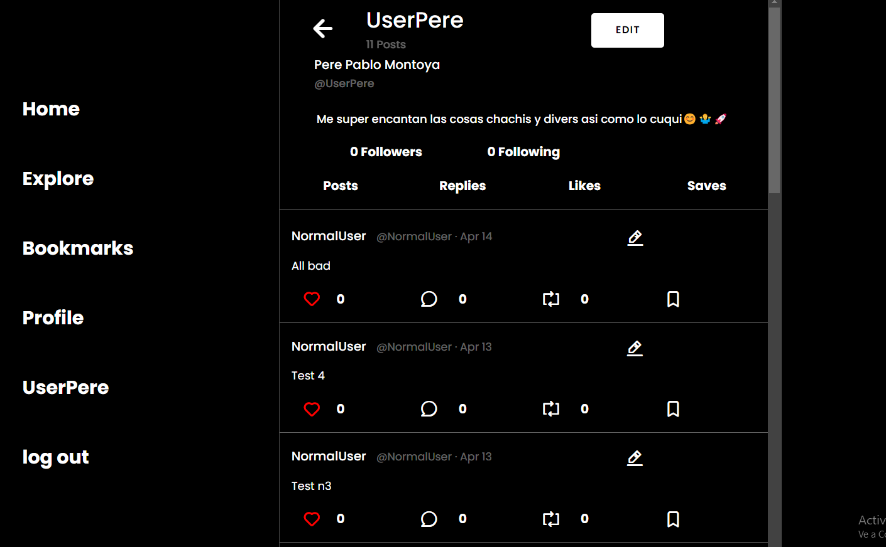

# Social Network React FrontEnd
  ¡Welcome all to my social media front reporsitory! This the seventh project at GeeksHubs Academy, consisting in the frontend in React of a social media site, in this case, one based on Tweeter, now X

  
  
  

## 🛠️ Tech&Tolls used 

## Install on local
1.  Clone this repository
2.  Run ` $ npm install ` in terminal
3.  Run and connect your mongooseDB
4.  Clone install and run the server available at: [Here](https://github.com/HyPolDev/Project-5_Linea)
5.  Start server:  ` $ npm run dev `

## ✒️ Autor

- **Pol Montero** - Project Developer
  - [GitHub](https://github.com/hypoldev) 

## 🎓 Special Thanks

- To **Geekshubs Academy** for the trust, encouragement and knowledges to make me able to develop this first project.

## 📄 Add Ons - Bugs and Dreams

- To finish the project whith all endpoints I planned on the backend
- I'd be nice to use google acc login or at least sing up with user name too
- Add the comment indent feature
- Add a search on the explore view
- I'd be nice to have a img database too.

#### Bugs 

At the time of release:
-  Edit post works a bit buggy
  

